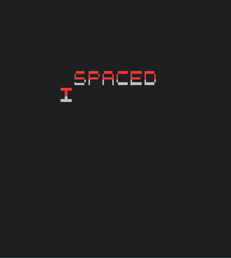

# spacedinvaders
A textual terminal spin on an arcade classic ... _and_ my [CS50X][cs50x] final project for the year that CoViD-19 made me want to forget.



Implemented using Python's builtin [`curses`][curses] module; no other dependencies _unless_ you want audio, see the caveat below.

## Installation

Assuming you've got Python 3.7+ installed you _should_ be able to install with:

```
pip install --user spacedinvaders
```

There's also _optional_ sound support, but see the caveats below if you run into any trouble:

```
pip install --user spacedinvaders[SOUNDS]
```

## Gameplay

Controls are pretty self-explanatory:

    Move Left    A KEY or LEFT ARROW
    Move Right   D KEY or RIGHT ARROW
    Fire         SPACE
    Quit         CTRL + Q

Though there might be others if you're looking for eggs.

## Caveats

### Unicode

Your terminal _and_ your font _must_ support unicode characters; run `spacedinvaders -h` and see if the UFO appears:

```
         ▁▁▁
        ▞█▀█▚
        ▔▘▔▝▔
```

### Terminal Sizing Issues

The game will complain vigorously if you've got it sized below the minimum possible number of rows and columns required for it to render the play field. Unfortunately this is _entirely_ dependent on your screen size and font settings. This is the nature of trying to squeeze arcade action into a `curses` based interface: if you've got a 1920x1080 screen and your font size is reasonably small it _should_ work, but be prepared to try setting your terminal to use smaller font sizing.

### Controls

Being that it's [`curses`][curses] the movement controls can feel a bit sloppy. You might want to play around with `xset r` settings to find an autorepeat that works for you.

### Audio

Sounds will only work with [`simpleaudio`][simpleaudio] and its dependencies installed. Worked out of the box for me, but Your Mileage May Vary. See [their docs][simpleaudion-install] for a first pass at troubleshooting.

## Credits
Couldn't have gotten anywhere near this accurate without the awesome resources at:

1. The useful descriptions of the arcade box's gameplay found at [Classic Gaming's overview][classicgaming]: they also get full credit for the audio files they've made available.

2. Some details about resolution on the original arcade screen found at [Retro Games][retrogames] filled in gaps from the above (and literally, on the screen).

3. Couldn't have gone the extra mile on the little details of Invader timings, sound, or general play details without the absolutely brilliant, and exhaustive, [excavations at Computer Archaeology][computerarchaeology], which honestly make all the difference in making this feel at least a little like the real thing.

 [cs50x]: https://cs50.harvard.edu/x/2020/
 [curses]: https://docs.python.org/3/howto/curses.html
 [simpleaudio]: https://simpleaudio.readthedocs.io/en/latest/
 [simpleuadio-install]: https://simpleaudio.readthedocs.io/en/latest/installation.html
 [classicgaming]: https://www.classicgaming.cc/classics/space-invaders/
 [retrogames]: http://tips.retrogames.com/gamepage/invaders.html
 [computerarchaeology]: https://www.computerarcheology.com/Arcade/SpaceInvaders/

